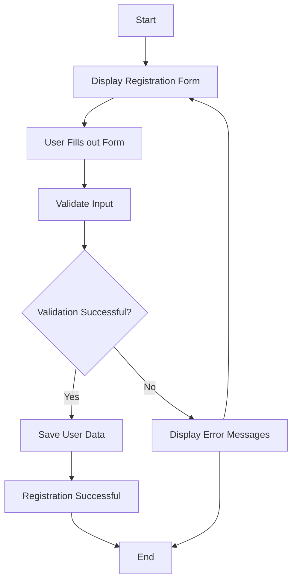

#MEDLIFE
Milestones	(https://github.com/fssa-batch3/sec_a_ishwarya.sankar__corejava_project_2/milestones)

##ER DIAGRAM
[

### Attributes:  
- [ ] userId  
- [ ] email  
- [ ] password  
- [ ] name  
- [ ] phone number  
- [ ] type  
- [ ] isDeleted###

 Validations:  
- [ ] validateUser()  
- [ ] validateName()  
- [ ] validateEmail()  
- [ ] validatePassword()  
- [ ] validatePhonenumber()  
- [ ] validateDeleteUser()### Test:  
- [ ] testValidateUser()  
- [ ] testValidateEmail()  
- [ ] testValidatePassword()  
- [ ] testValidatePhonenumber()  
- [ ] testValidateName()### DAO:  
- [ ] createUser()  
- [ ] isEmailExists()### Service:  
- [ ] registerUser()###

 Test:  
- [ ] testRegistrationSuccess()  
- [ ] testRegistrationEmailEmpty()  
- [ ] testRegistrationphonenumer()  
- [ ] testRegistrationEmptyPassword()  
- [ ] testRegistrationNullPassword()  
- [ ] testRegistrationEmptyUsername()  
- [ ] testRegistrationNullUser()### Estimation  
- [ ] 6 hrs### 

Flow  

