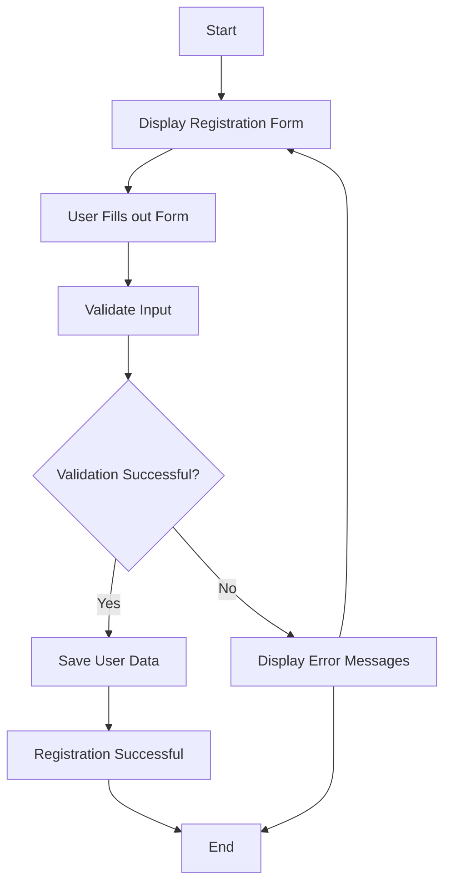

#MEDLIFE
Milestones	(https://github.com/fssa-batch3/sec_a_ishwarya.sankar__corejava_project_2/milestones)

##ER DIAGRAM
[

### Attributes:  
- [ ] userId  
- [ ] email  
- [ ] password  
- [ ] name  
- [ ] phone number  
- [ ] type  
- [ ] isDeleted###

 Validations:  
- [ ] validateUser()  
- [ ] validateName()  
- [ ] validateEmail()  
- [ ] validatePassword()  
- [ ] validatePhonenumber()  
- [ ] validateDeleteUser()### Test:  
- [ ] testValidateUser()  
- [ ] testValidateEmail()  
- [ ] testValidatePassword()  
- [ ] testValidatePhonenumber()  
- [ ] testValidateName()### DAO:  
- [ ] createUser()  
- [ ] isEmailExists()### Service:  
- [ ] registerUser()###

 Test:  
- [ ] testRegistrationSuccess()  
- [ ] testRegistrationEmailEmpty()  
- [ ] testRegistrationphonenumer()  
- [ ] testRegistrationEmptyPassword()  
- [ ] testRegistrationNullPassword()  
- [ ] testRegistrationEmptyUsername()  
- [ ] testRegistrationNullUser()### Estimation  
- [ ] 6 hrs### 

Flow  

## Table of Contents

1. [Introduction](#introduction)
    - Purpose
    - Features
    - User Persona
2. [Prerequisites](#prerequisites)
    - Software Requirements
    - Database Setup
3. [Project Setup](#project-setup)
    - Java Project Creation
    - Reparo Dependencies
4. [Database](#database)
    - Entity-Relationship Diagram (ERD)
    - Database Tables
5. [Modules](#modules)
    - User Module
    - Medicine Module 
    - doctor Module
 

6. [Validations](#validations)
    - MedicineValidator Validations
    - UserValidator Validations

7. [Testing](#testing)
    - Unit Testing
8. [Exception Handling](#exception-handling)
    - Common Error Messages
    - Exception Handling
9. [Future Improvements](#future-improvements)
    - Planned Features
    - Roadmap
10. [Resources](#resources)
    - External Libraries
    - References

## Introduction

### Purpose
The purpose of this application is to know more details about the hospital and book the appointment with doctor and also they can buy medicine through line.

### Features

- Register, Login, Update, Delete User.
-Create Medicine,Update Medicine , Delete medicine , Read Medicine

### User Persona

- Admin
- Doctor
- Patient
- seller

## Prerequisites

### Software Requirements

- Java Development Kit (JDK)
- MySQL Database Server
- Integrated Development Environment

### Database Setup

- Table scripts: [Script](database_setup.sql)

## Project Setup

### Java Project Creation

- Create a new Java project
- Set up a MySQL database

### Library Dependencies

- JDBC,
- MySQL Connector,
- JUnit,

## Database

### Entity-Relationship Diagram (ERD)

### Database Tables

#### Table: user. 

| Field           | Type          | Null | Key | Default           | Extra |
|-----------------|---------------|------|-----|-------------------|-------|
| id              | INT           | NO   | PRI | auto_increment    |       |
| email           | varchar(50)   | NO   |     |                   |       |
| userName        |  varchar(50)  | NO   |     |                   |       |
| password        | varchar(10)   | NO   |     |                   |       |
| phone_number    | varchar(10)   | NO   |     |                   |       |
|type             | varchar(50)   | NO   |     |                   |       |
|isDeleted        | Tinyint(1)    | NO   |     | CURRENT_TIMESTAMP |       |

#### Table: medicine.

| Field           | Type          | Null | Key | Default           | Extra |
|-----------------|---------------|------|-----|-------------------|-------|
| id              | INT           | NO   | PRI | auto_increment    |       |
| medicine_name   | varchar(100)  | NO   |     |                   |       |
| medicine_rupe   | varchar(15)   | NO   |     |                   |       |
| medicine_url    | varchar(100)  | NO   |     |                   |       |
| user_id         | varchar(100)  | NO   |     |                   |       |
| is_deleted      | varchar(2048) | NO   |     |                   |       |

## Modules

### User Module :

- Add a user:
    - Allows to register new users.
- Update user details:
    - Enables to modify user information such as name, password, etc.
  
### medicine Module :

- Add a medicine:
    - Allows to register new Workshop.
- View medicine details:
    - Display detailed information about a specific medicine when selected.
- Update medicine details:
    - Enables to modify medicine information such as medicine_name, medicine_rupees, etc.
- Remove a medicine:
    - Allows to remove a medicine.

## Validations

### User Validations :

- String  Validation
- Number Validation
- password Validation
- User validation

### medicine  Validations :

- medicine_name  Validation
- medicine_rupees Validation
- 
  

